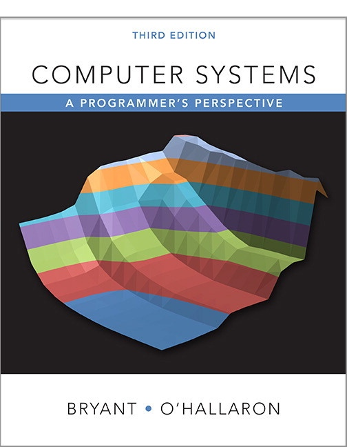

# 深入理解计算机系统（原书第3版）

书籍配套网站：http://csapp.cs.cmu.edu/3e/home.html  
CMU 2016 年的 `CS:APP` 课程资源网站(包括在线视频、课件)：http://www.cs.cmu.edu/afs/cs/academic/class/15213-s16/www/schedule.html  

## 参考资源

豆瓣书评(有些长评论写的比较好)：https://book.douban.com/subject/26912767/

